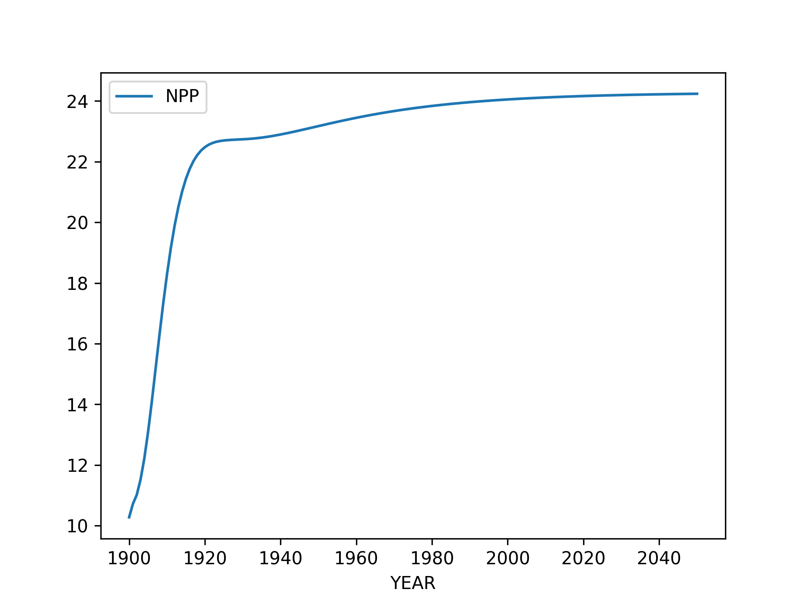
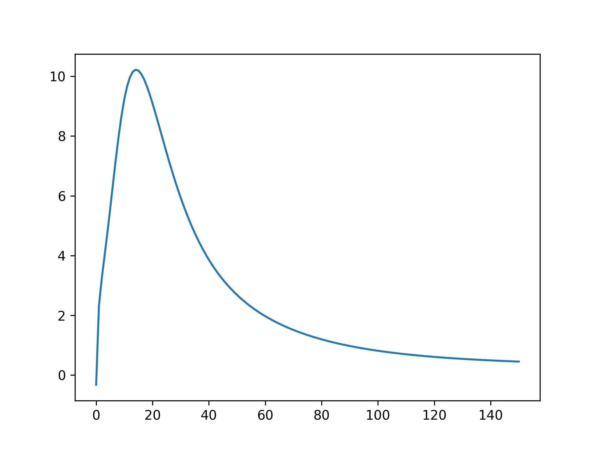
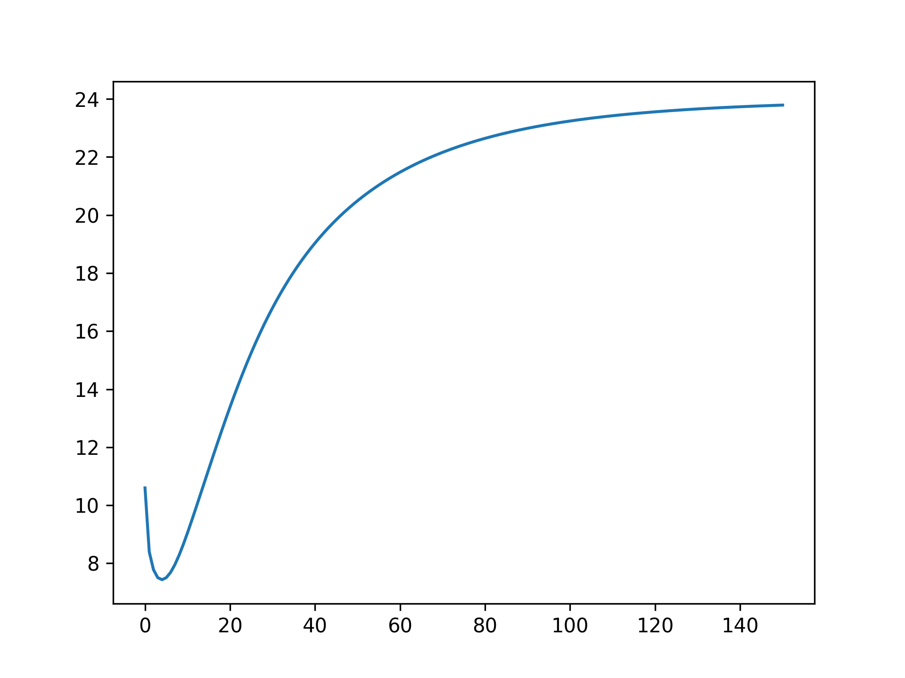

# Moja-Global-GCBM.Belize-Analysis-Scripts
Scripts to simulate GCBM.Belize and plots NPP, Rh, NEP and NBP variables

This repository contains some scripts to simulate GCBM.Belize and plots NPP, Rh, NEP and NBP variables :

## Scripts

Following is a quick description of the scripts:

1. [`total_flux_tc_script.py`](https://github.com/ankitaS11/Moja-Global-GCBM.Belize-Analysis-Scripts/blob/main/total_flux_tc_script.py): This script plots the total flux (unit: tc).
2. [`get_metadata.py`](https://github.com/ankitaS11/Moja-Global-GCBM.Belize-Analysis-Scripts/blob/main/get_metadata.py):
  - This script creates a CSV file from the given indicator in `output/` folder.
  - Use it like: `python3 get_metadata.py <indicator_name> <db_path>`
3. [`plot_metadata.py`](https://github.com/ankitaS11/Moja-Global-GCBM.Belize-Analysis-Scripts/blob/main/plot_metadata.py):
  - This plots for the given CSV file and label.
  - X axis is always the "YEAR" column in the CSV file.
  - Use it like: `python3 plot_metadata.py <COLUMN_NAME_FOR_Y_AXIS> <path_to_CSV>`
4. [`generate_rh.py`](https://github.com/ankitaS11/Moja-Global-GCBM.Belize-Analysis-Scripts/blob/main/generate_rh.py):
  - This generates `Rh` from `NPP` and `NEP` and stores the output in `output/metadata.csv` file
5. [`generate_de.py`](https://github.com/ankitaS11/Moja-Global-GCBM.Belize-Analysis-Scripts/blob/main/generate_de.py):
  - This generates `DE` from `NEP` and `NBP` and stores the output in `output/metadata_with_de.csv` file

## Visualizations

NPP</img>
  
NEP</img>
  
NBP</img>
  
Rh</img>
  
